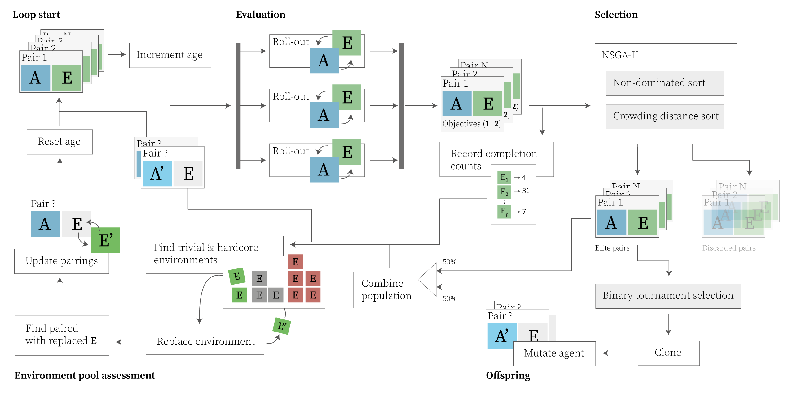
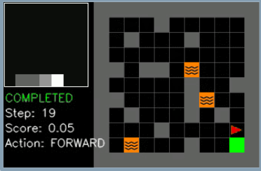
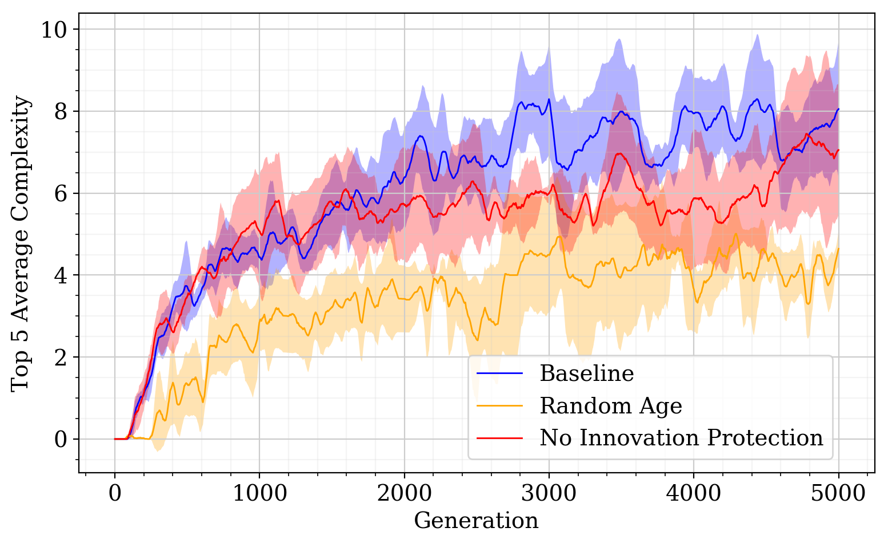

## **MODAC**
# **M**ulti-**O**bjective **D**ifficulty **A**djusting **C**o-evolution

Motivated by recent advancements in open-ended research, and the utilization of step-ping stones to unlock potential in genetic algorithms, this thesis presents the Multi-Objective Difficulty Adjusting Coevolution (MODAC) algorithm. MODAC utilizes inno-vation protection to preserve stepping stones uncovered as part of a coevolutionaryprocess in a paired agent-environment setting.  It simultaneously generates progres-sively complex environments and their solutions, approximating aspects of an open-ended process, where many concurrent branches of agent policies proliferate. It doesthis by evolving a pool of environments alongside agents, where the difficulty of theenvironments are adjusted according to the capabilities of the agents.  MODAC pro-vides new insight into the capabilities of the innovation protection mechanism, withexperiments showing it has positive effect when applied to both problem and problemsolver. However, the benefit is minor compared to previous work. It was observed thatthe application of innovation protection lead to better utilization of the coevolved en-vironment pool, ultimately leading to slightly more general agent policies.  The mostcomplex environments evolved by MODAC were solved by a simple genetic algorithm.This shows that MODAC is not able to generate challenges that can not be directlyoptimized towards.  However, the general performance of the agents evolved throughdirect optimization was inferior to those evolved by MODAC. All in all, MODAC showedthat innovation protection can be beneficial when applied to a domain where both theproblem and the solution require reduced selection pressure.  Additionally, dynamically adjusting the difficulty of generated environments led to the discovery of moregeneral solutions

# Content
- Background :mag:
- The MODAC algorithm :bomb:
- Experimental setup :microscope:
    - Agents :ghost:
    - Environments :earth_africa:
- Experimental results :bar_chart:
- Related Work :books:
<!-- Code overview -->

# Background
// TODO

# The Algorithm
// TODO...
Something along the lines of this:

# Experimental Setup
// TODO



## Agents
// TODO
## Environments
// TODO.. I was suppoed to be a video:

# Experimental Results
// TODO
Here, have a nice chart:

# Related Work
// TODO, at least mention POET

# Acknowledgements
... Thanks everybody